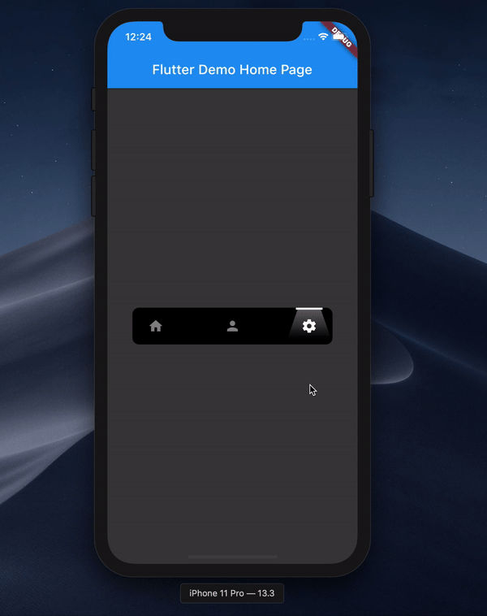

# Spotlight Bottom App Bar

A bottom app bar made in flutter spotlight design.

Star⭐ the repo if you like what you see😉.

## ✨ Requirements
* Any Operating System (ie. MacOS X, Linux, Windows)
* Any IDE with Flutter SDK installed (ie. IntelliJ, Android Studio, VSCode etc)
* A little knowledge of Dart and Flutter

Designed Credit : [Sanchita Agarwal](https://www.behance.net/sanchitaagrawal26)

Original Design present on [Behance](https://www.behance.net/gallery/94842819/Animated-Tab-Bar)

Sample: 

